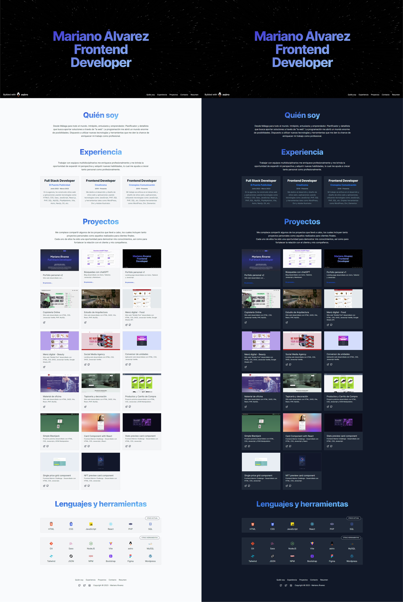
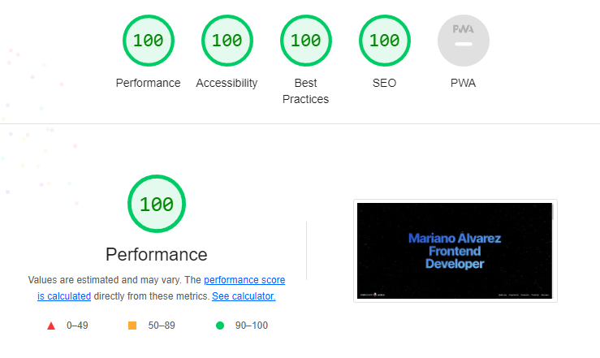

# Astro Landing Page

Este es mi portfolio v1 personal, diseñado y desarrollado con [Astro.build](https://astro.build) y [Tailwind CSS](https://tailwindcss.com). Astro.build me permitió crear una experiencia de usuario fluida y optimizada, mientras que Tailwind CSS me proporcionó un conjunto de herramientas para estilizar rápidamente mi sitio web. El resultado es una página web moderna y elegante que refleja mi trabajo y habilidades. ¡Gracias por visitar!

## Screenshots

## Lighthouse scores

| Performance | Accessibility | Best Practices | SEO  | PWAs |
| :---------: | :-----------: | :------------: | :--: | :--: |
|    100%     |     100%      |      100%      | 100% | S/D  |

## Comandos

| Command                | Action                                            |
| :--------------------- | :------------------------------------------------ |
| `npm install`          | Install dependencies                              |
| `npm run dev`          | Start local dev server at `localhost:3000`        |
| `npm run build`        | Build your production site to `./dist/`           |
| `npm run preview`      | Preview your build locally, before deploying      |
| `npm run astro ...`    | Run CLI commands like `astro add`, `astro check`  |
| `npm run astro --help` | Get help using the Astro CLI                      |
| `npm run format`       | Format code with [Prettier](https://prettier.io/) |
| `npm run clean`        | Remove `node_modules` and build output            |

## Creditos

- Template creado por [mhyfritz](https://github.com/mhyfritz/astro-landing-page).
- Otros elementos y datos fueron tomados de [Astro](https://astro.build) y [Tailwind CSS](https://tailwindcss.com).
